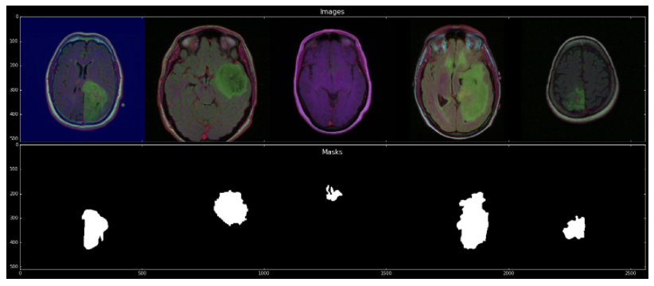

# Optimizing U-net with TVM

11조, 김영곤, 이종현, 이찬우

---

# Table of Contents

##### 1. Motivation
##### 2. Review 
##### 3. Aim

---
# 1. Motivation

- 의료 분야에도 AI 도입이 적극적으로 진행 중
- 그러나 기술에 대한 이해 부족, 의료 수가 시스템, 개인정보 이슈 등 한계가 많음
- 의료 분야에서 활발히 AI를 사용하기 위해서는 부족한 계산 능력을 보완해줄 수 있는 최적화가 필수적

### `그렇다면 의료 AI에서 가장 많이 쓰이는 U-net 모델을 TVM을 이용해서 최적화해보자!`

---
# 2. Review

- U-net: Convolutional networks for biomedical image segmentation (2015)
  - Biomedical 분야에서 segmentation 등을 위해 만들어진 CNN 모델
  - Autoencoder와 같이 Encoder - Decoder의 구조
  - U 자의 모양으로 U-net 이라는 이름이 붙여짐
  - 3 x 3 convolution 연산의 반복으로 모델이 구성

---
# 2. Review

---
# 2. Review

CNN의 연산이 무거워... 해결 방법은?

- Designing energy-efficient convolutional neural networks using energy-aware pruning (2017)
  - CNN의 무거운 연산이 edge device의 energy 낭비를 유발한다.
  - network pruning을 통해 계산량을 줄이자!
  - network의 최적화를 통해 성능은 유지하면서 계산량을 줄일 수 있었다.

---
# 2. Review

CNN의 연산이 무거워... 해결 방법은?

- Neurosurgeon: Collaborative intelligence between the cloud and mobile edge (2017)
  - edge의 낮은 성능과 cloud의 network I/O 때문에 trade-off가 발생한다. 
  - 적절한 시점에서 cloud 환경과 edge 환경의 communication을 활용하자!
  - edge device에서 적절한 수준의 연산을 한 후, 가장 energy effieciency 한 포인트에서 cloud로 데이터를 전달하여 양 측면의 장점을 모두 활용한다. 

---
# 2. Review

**보안**이 상대적으로 강조되는 의료 분야에서 외부로 데이터를 전송하는 cloud 환경에 대한 선호는 높지 않다

그렇다고 해서 내부적으로 데이터 센터를 구축하기에는 제약 상황이 많다

---
# 2. Review

 - Optimizing CNN model inference on cpus (2019)
   - GPU가 CPU보다 CNN 연산에 유리하지만, 모두가 GPU는 없잖아?
   - 그렇다면 NeoCPU를 이용하여 CPU에서의 최적화를 진행하자.

edge device 자체에서의 최적화라는 점은 우리의 목표와 일맥상통
병원에서 사용하는 target HW platform은 꼭 CPU만은 아닐 수 있다는 점에서 우리는 TVM을 선택

---
# 3. Aim

1. Build simple U-net model with **pytorch** (or keras)
2. Train our model with brain tumor segmentation task
   - https://www.kaggle.com/mateuszbuda/lgg-mri-segmentation
3. Optimize our model with **TVM**
   - RaspberryPi 3, CPU, GPU, and M1 mac NPU, etc
4. Compare the performance of various target platform

---
# 3. Aim

---
# Q&A
 
 
 
 

## $~~~~~~~~~~~~~~~~~~~~~~~~~$ Thank you! 