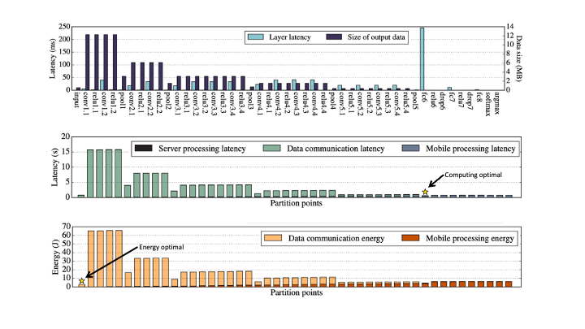

# Paper review: Neurosurgeon

2021234640 이종현

---

# Table of Contents

##### 1. Motivation
##### 2. Experiments & Results 
##### 3. Discussion

---
# 1. Motivation

- Edge와 Cloud: Computing latency와 Communication latency가 존재
- Mobile device에서 구동되는 AI application은 cloud-only 접근
- Edge device의 energy와 Cloud의 communication burden을 최소화해보자

#### `Model arcitecture를 적당한 지점에서 partitioning하여 energy, communication latency를 optimize하자!`

---
# 2. Experiments & Results

- 두 개의 regression model: 사용자의 목적에 따라 취사 선택
  - 모델의 parameter 개수, input-output 데이터 dimensions 고려
  - Computing latency를 예측하는 regressor
    - 가장 연산 속도가 낮을 것으로 예측되는 partitioning 레이어 선정
  - Power efficiency를 예측하는 regressor
    - 가장 에너지 소모가 낮을 것으로 예측되는 partitioning 레이어 선정

---
# 2. Experiments & Results

---
# 3. Discussion

- Edge device와 Cloud 환경을 최대한 활용하기 위한 전략
- 5G 등의 고성능 무선 네트워크가 구축되면 그 중요성은 덜해질 수 있으나 3G, LTE 등이 혼재한 현재 아주 중요한 가치
- 네트워크 자체에 최적화를 요구하지 않는다는 장점
- 모델의 partitioning이 아닌 data에 partitioning이 적용되어 edge-cloud를 parallel하게 사용할 수도 있지 않을까?

---
# Q&A
 
 
 
 

## $~~~~~~~~~~~~~~~~~~~~~~~~~$ Thank you! 